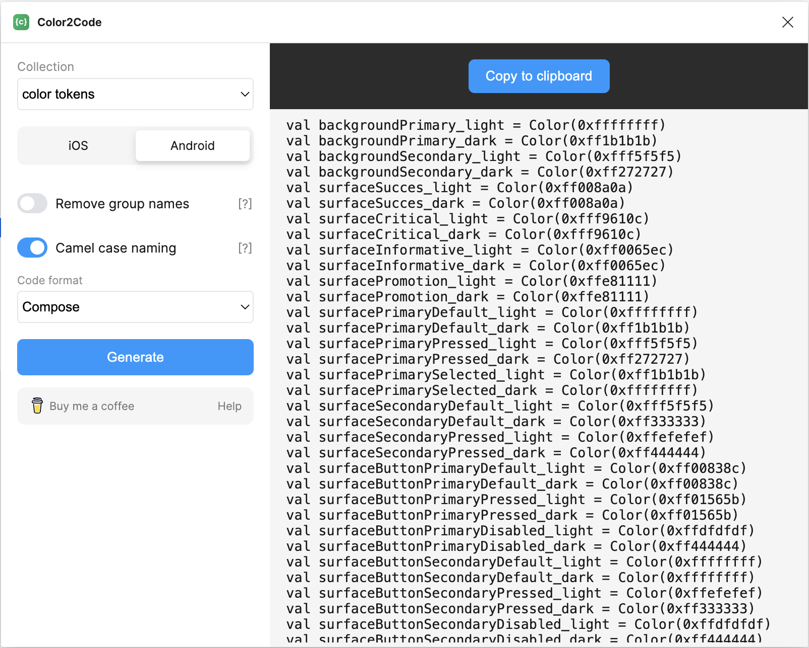

# Color Parser

This script converts color tokens from Figma to Compose format. It is designed to be used with the
figma 'Color2Code' plugin, which exports the Color Tokens.

## Requirements

- Android Studio
- 'Color2Code' plugin for Figma
- command line kotlin (`brew install kotlin`)

## Usage

1. Open the Color Tokens page in Figma.
2. Run the [Color2Code](https://www.figma.com/community/plugin/1262830857362718014) plugin in Figma.
   Note: you need Design or Dewv Mode for this, perhaps you need to do
   this in collaboration with a designer.
3. Export the Color Tokens using the plugin. Select `Android` and format `Compose`. Disable `Remove group names`; enable
   `Camel case naming`.
   
4. Copy the output of the plugin and paste it into the `color_parser_input.txt` file.
5. Run the `ColorParser.kts` script by clicking the play button in the file or running

   `(cd ./scripts/colorparser && ./ColorParser.kts)`

6. The script will update the `AppColorScheme.kt` file and the corresponding files for both the
   light and dark themes.

## File Structure

- `color_parser_input.kt`: Paste the output of the 'Color2Code' plugin here.
- `ColorParser.kts`: Script to parse the color tokens and generate the Compose code.
  `
